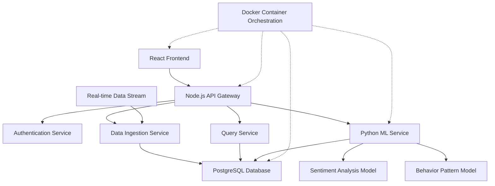
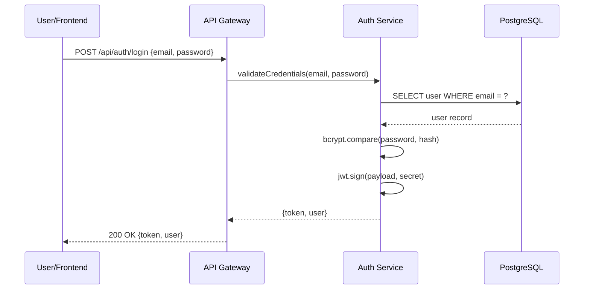
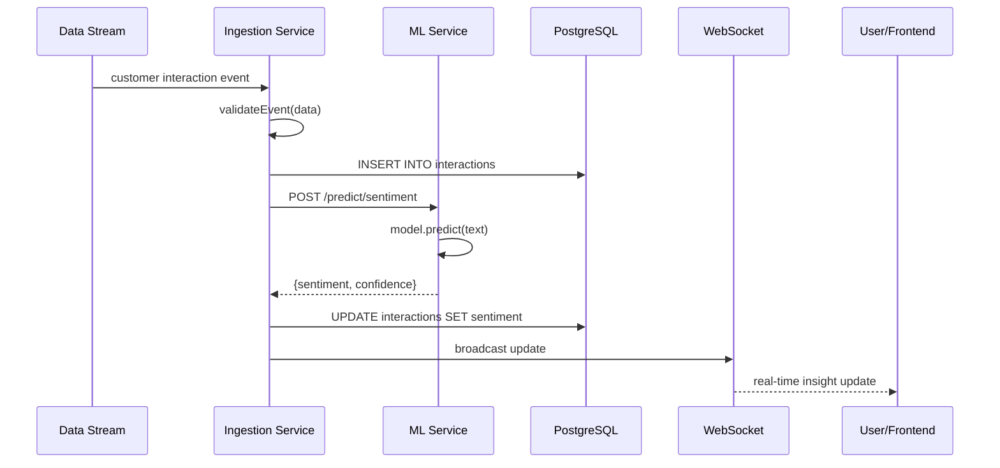
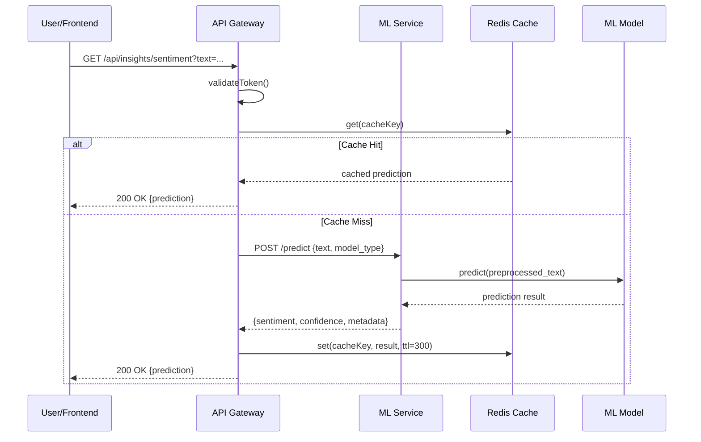

# Design Document: AI-Powered Customer Insights Platform

## Overview

The AI-Powered Customer Insights Platform is a web application that enables businesses to understand customer behavior patterns and sentiment trends through real-time analysis of user interactions and feedback data. The platform processes over 50,000 data points, leveraging machine learning models to provide actionable insights with sub-500ms API response times. The system is built using a modern microservices architecture with React.js frontend, Node.js backend API layer, Python-based ML services, and PostgreSQL database, all containerized using Docker for consistent deployment across environments.

The platform provides real-time data processing capabilities, user authentication, and a structured database schema optimized for efficient queries through strategic indexing. The architecture separates concerns between presentation (React), business logic (Node.js), ML inference (Python), and data persistence (PostgreSQL), enabling independent scaling and maintenance of each component.

## Architecture

The system follows a microservices architecture with clear separation between frontend, API gateway, ML services, and data layer:



## Sequence Diagrams

### User Authentication Flow



### Real-time Data Processing Flow



### ML Prediction Request Flow




## Components and Interfaces

### Component 1: React Frontend

**Purpose**: Provides the user interface for visualizing customer insights, managing dashboards, and configuring analysis parameters.

**Interface**:
```typescript
// Main App Component
interface AppProps {
  authToken: string | null;
  user: User | null;
}

// Dashboard Component
interface DashboardProps {
  timeRange: TimeRange;
  filters: InsightFilters;
  onFilterChange: (filters: InsightFilters) => void;
}

// Insight Visualization Component
interface InsightVisualizationProps {
  data: InsightData[];
  chartType: 'line' | 'bar' | 'heatmap';
  realTimeUpdates: boolean;
}
```

**Responsibilities**:
- Render interactive dashboards with real-time updates
- Handle user authentication state management
- Communicate with API Gateway via REST and WebSocket
- Provide responsive UI for mobile and desktop
- Cache visualization data for performance

### Component 2: Node.js API Gateway

**Purpose**: Serves as the central entry point for all client requests, handling routing, authentication, rate limiting, and orchestration between services.

**Interface**:
```typescript
// Express Router Interfaces
interface AuthRoutes {
  POST_login(req: LoginRequest): Promise<AuthResponse>;
  POST_register(req: RegisterRequest): Promise<AuthResponse>;
  POST_refresh(req: RefreshTokenRequest): Promise<TokenResponse>;
  POST_logout(req: LogoutRequest): Promise<void>;
}

interface InsightsRoutes {
  GET_insights(req: InsightsQueryRequest): Promise<InsightsResponse>;
  GET_sentiment(req: SentimentRequest): Promise<SentimentResponse>;
  GET_patterns(req: PatternRequest): Promise<PatternResponse>;
  POST_analyze(req: AnalyzeRequest): Promise<AnalysisResponse>;
}

interface DataRoutes {
  POST_ingest(req: DataIngestionRequest): Promise<IngestionResponse>;
  GET_interactions(req: InteractionQueryRequest): Promise<InteractionResponse>;
  PUT_interaction(req: UpdateInteractionRequest): Promise<void>;
}

// Middleware
interface AuthMiddleware {
  verifyToken(req: Request, res: Response, next: NextFunction): void;
  checkPermissions(permissions: string[]): MiddlewareFunction;
}

interface RateLimitMiddleware {
  limitByUser(maxRequests: number, windowMs: number): MiddlewareFunction;
  limitByEndpoint(config: RateLimitConfig): MiddlewareFunction;
}
```

**Responsibilities**:
- Route requests to appropriate microservices
- Validate and authenticate JWT tokens
- Implement rate limiting (100 requests/minute per user)
- Transform and aggregate responses from multiple services
- Handle error responses and logging
- Maintain WebSocket connections for real-time updates

### Component 3: Authentication Service

**Purpose**: Manages user authentication, authorization, and session management with secure token generation.

**Interface**:
```typescript
interface AuthService {
  validateCredentials(email: string, password: string): Promise<User | null>;
  hashPassword(password: string): Promise<string>;
  comparePassword(password: string, hash: string): Promise<boolean>;
  generateToken(user: User): string;
  verifyToken(token: string): TokenPayload | null;
  refreshToken(refreshToken: string): Promise<string>;
  revokeToken(token: string): Promise<void>;
}

interface TokenPayload {
  userId: string;
  email: string;
  role: UserRole;
  permissions: string[];
  iat: number;
  exp: number;
}
```

**Responsibilities**:
- Hash passwords using bcrypt (10 rounds)
- Generate JWT tokens with 1-hour expiration
- Validate token signatures and expiration
- Manage refresh tokens with 7-day expiration
- Store revoked tokens in blacklist

### Component 4: Data Ingestion Service

**Purpose**: Processes incoming customer interaction data, validates it, and stores it in the database while triggering ML analysis.

**Interface**:
```typescript
interface DataIngestionService {
  ingestInteraction(data: InteractionData): Promise<string>;
  validateInteraction(data: InteractionData): ValidationResult;
  batchIngest(data: InteractionData[]): Promise<BatchResult>;
  enrichInteraction(data: InteractionData): Promise<EnrichedInteraction>;
}

interface InteractionData {
  customerId: string;
  timestamp: Date;
  channel: 'web' | 'mobile' | 'email' | 'chat';
  eventType: string;
  content: string;
  metadata: Record<string, any>;
}

interface ValidationResult {
  valid: boolean;
  errors: ValidationError[];
}
```

**Responsibilities**:
- Validate incoming data against schema
- Enrich data with additional context
- Store interactions in PostgreSQL
- Trigger asynchronous ML analysis
- Handle batch ingestion for bulk imports
- Emit events for real-time processing


### Component 5: Query Service

**Purpose**: Provides optimized read access to customer insights data with support for complex filtering, aggregation, and pagination.

**Interface**:
```typescript
interface QueryService {
  getInsights(filters: InsightFilters, pagination: Pagination): Promise<InsightResult>;
  getSentimentTrends(timeRange: TimeRange, groupBy: string): Promise<TrendData[]>;
  getBehaviorPatterns(customerId: string): Promise<PatternData[]>;
  getAggregatedMetrics(filters: InsightFilters): Promise<MetricsData>;
  searchInteractions(query: SearchQuery): Promise<InteractionResult>;
}

interface InsightFilters {
  startDate?: Date;
  endDate?: Date;
  channels?: string[];
  sentimentRange?: [number, number];
  customerSegments?: string[];
}

interface Pagination {
  page: number;
  pageSize: number;
  sortBy?: string;
  sortOrder?: 'asc' | 'desc';
}
```

**Responsibilities**:
- Execute optimized SQL queries with proper indexing
- Implement pagination for large result sets
- Cache frequently accessed queries
- Aggregate data across multiple dimensions
- Support full-text search on interaction content

### Component 6: Python ML Service

**Purpose**: Provides machine learning inference for sentiment analysis and behavior pattern detection with sub-500ms response times.

**Interface**:
```python
from typing import Dict, List, Optional
from dataclasses import dataclass

@dataclass
class PredictionRequest:
    text: str
    model_type: str
    customer_id: Optional[str] = None
    metadata: Optional[Dict] = None

@dataclass
class PredictionResponse:
    sentiment: str  # 'positive', 'negative', 'neutral'
    confidence: float
    scores: Dict[str, float]
    processing_time_ms: float

class MLService:
    def predict_sentiment(self, request: PredictionRequest) -> PredictionResponse:
        """Predict sentiment from text with confidence scores"""
        pass
    
    def detect_patterns(self, customer_id: str, interactions: List[Dict]) -> List[Pattern]:
        """Detect behavior patterns from customer interaction history"""
        pass
    
    def batch_predict(self, requests: List[PredictionRequest]) -> List[PredictionResponse]:
        """Process multiple predictions in batch for efficiency"""
        pass
    
    def get_model_info(self, model_type: str) -> ModelInfo:
        """Return model metadata and performance metrics"""
        pass

@dataclass
class Pattern:
    pattern_type: str
    confidence: float
    frequency: int
    description: str
    metadata: Dict
```

**Responsibilities**:
- Load pre-trained ML models on service startup
- Preprocess text data (tokenization, normalization)
- Execute model inference with GPU acceleration if available
- Return predictions within 500ms SLA
- Log prediction metrics for monitoring
- Support model versioning and A/B testing


## Data Models

### Model 1: User

```typescript
interface User {
  id: string;              // UUID primary key
  email: string;           // Unique, indexed
  passwordHash: string;    // bcrypt hash
  firstName: string;
  lastName: string;
  role: UserRole;
  permissions: string[];
  organizationId: string;  // Foreign key to Organization
  createdAt: Date;
  updatedAt: Date;
  lastLoginAt: Date | null;
}

enum UserRole {
  ADMIN = 'admin',
  ANALYST = 'analyst',
  VIEWER = 'viewer'
}
```

**Validation Rules**:
- Email must be valid format and unique
- Password must be at least 12 characters with mixed case, numbers, and symbols
- Role must be one of defined enum values
- organizationId must reference existing organization

**Database Schema**:
```sql
CREATE TABLE users (
  id UUID PRIMARY KEY DEFAULT gen_random_uuid(),
  email VARCHAR(255) UNIQUE NOT NULL,
  password_hash VARCHAR(255) NOT NULL,
  first_name VARCHAR(100) NOT NULL,
  last_name VARCHAR(100) NOT NULL,
  role VARCHAR(50) NOT NULL,
  permissions JSONB DEFAULT '[]',
  organization_id UUID NOT NULL REFERENCES organizations(id),
  created_at TIMESTAMP DEFAULT NOW(),
  updated_at TIMESTAMP DEFAULT NOW(),
  last_login_at TIMESTAMP
);

CREATE INDEX idx_users_email ON users(email);
CREATE INDEX idx_users_organization ON users(organization_id);
```

### Model 2: CustomerInteraction

```typescript
interface CustomerInteraction {
  id: string;                    // UUID primary key
  customerId: string;            // Foreign key to Customer
  organizationId: string;        // Foreign key to Organization
  timestamp: Date;               // Indexed for time-range queries
  channel: InteractionChannel;
  eventType: string;
  content: string;               // Full-text indexed
  sentiment: SentimentScore | null;
  sentimentConfidence: number | null;
  metadata: Record<string, any>;
  processedAt: Date | null;
  createdAt: Date;
}

enum InteractionChannel {
  WEB = 'web',
  MOBILE = 'mobile',
  EMAIL = 'email',
  CHAT = 'chat',
  PHONE = 'phone'
}

interface SentimentScore {
  label: 'positive' | 'negative' | 'neutral';
  positive: number;
  negative: number;
  neutral: number;
}
```

**Validation Rules**:
- customerId and organizationId must reference existing records
- timestamp must not be in the future
- channel must be one of defined enum values
- content must not be empty for text-based channels
- sentiment scores must be between 0 and 1
- sentimentConfidence must be between 0 and 1 if present

**Database Schema**:
```sql
CREATE TABLE customer_interactions (
  id UUID PRIMARY KEY DEFAULT gen_random_uuid(),
  customer_id UUID NOT NULL REFERENCES customers(id),
  organization_id UUID NOT NULL REFERENCES organizations(id),
  timestamp TIMESTAMP NOT NULL,
  channel VARCHAR(50) NOT NULL,
  event_type VARCHAR(100) NOT NULL,
  content TEXT,
  sentiment JSONB,
  sentiment_confidence DECIMAL(5,4),
  metadata JSONB DEFAULT '{}',
  processed_at TIMESTAMP,
  created_at TIMESTAMP DEFAULT NOW()
);

CREATE INDEX idx_interactions_customer ON customer_interactions(customer_id);
CREATE INDEX idx_interactions_org ON customer_interactions(organization_id);
CREATE INDEX idx_interactions_timestamp ON customer_interactions(timestamp DESC);
CREATE INDEX idx_interactions_channel ON customer_interactions(channel);
CREATE INDEX idx_interactions_sentiment ON customer_interactions((sentiment->>'label'));
CREATE INDEX idx_interactions_content_fts ON customer_interactions USING gin(to_tsvector('english', content));
```

### Model 3: Customer

```typescript
interface Customer {
  id: string;                    // UUID primary key
  organizationId: string;        // Foreign key to Organization
  externalId: string;            // Client's customer ID, indexed
  email: string | null;
  firstName: string | null;
  lastName: string | null;
  segment: string | null;
  metadata: Record<string, any>;
  firstSeenAt: Date;
  lastSeenAt: Date;
  interactionCount: number;
  averageSentiment: number | null;
  createdAt: Date;
  updatedAt: Date;
}
```

**Validation Rules**:
- organizationId must reference existing organization
- externalId must be unique within organization
- email must be valid format if provided
- averageSentiment must be between -1 and 1 if present
- interactionCount must be non-negative

**Database Schema**:
```sql
CREATE TABLE customers (
  id UUID PRIMARY KEY DEFAULT gen_random_uuid(),
  organization_id UUID NOT NULL REFERENCES organizations(id),
  external_id VARCHAR(255) NOT NULL,
  email VARCHAR(255),
  first_name VARCHAR(100),
  last_name VARCHAR(100),
  segment VARCHAR(100),
  metadata JSONB DEFAULT '{}',
  first_seen_at TIMESTAMP NOT NULL,
  last_seen_at TIMESTAMP NOT NULL,
  interaction_count INTEGER DEFAULT 0,
  average_sentiment DECIMAL(5,4),
  created_at TIMESTAMP DEFAULT NOW(),
  updated_at TIMESTAMP DEFAULT NOW(),
  UNIQUE(organization_id, external_id)
);

CREATE INDEX idx_customers_org ON customers(organization_id);
CREATE INDEX idx_customers_external_id ON customers(organization_id, external_id);
CREATE INDEX idx_customers_email ON customers(email);
CREATE INDEX idx_customers_segment ON customers(segment);
```

### Model 4: BehaviorPattern

```typescript
interface BehaviorPattern {
  id: string;                    // UUID primary key
  customerId: string;            // Foreign key to Customer
  organizationId: string;        // Foreign key to Organization
  patternType: string;           // e.g., 'frequent_visitor', 'cart_abandoner'
  confidence: number;            // 0-1 confidence score
  frequency: number;             // How often pattern occurs
  description: string;
  metadata: Record<string, any>;
  detectedAt: Date;
  validUntil: Date | null;       // Pattern expiration
  createdAt: Date;
}
```

**Validation Rules**:
- customerId and organizationId must reference existing records
- confidence must be between 0 and 1
- frequency must be positive integer
- detectedAt must not be in the future
- validUntil must be after detectedAt if present

**Database Schema**:
```sql
CREATE TABLE behavior_patterns (
  id UUID PRIMARY KEY DEFAULT gen_random_uuid(),
  customer_id UUID NOT NULL REFERENCES customers(id),
  organization_id UUID NOT NULL REFERENCES organizations(id),
  pattern_type VARCHAR(100) NOT NULL,
  confidence DECIMAL(5,4) NOT NULL,
  frequency INTEGER NOT NULL,
  description TEXT,
  metadata JSONB DEFAULT '{}',
  detected_at TIMESTAMP NOT NULL,
  valid_until TIMESTAMP,
  created_at TIMESTAMP DEFAULT NOW()
);

CREATE INDEX idx_patterns_customer ON behavior_patterns(customer_id);
CREATE INDEX idx_patterns_org ON behavior_patterns(organization_id);
CREATE INDEX idx_patterns_type ON behavior_patterns(pattern_type);
CREATE INDEX idx_patterns_detected ON behavior_patterns(detected_at DESC);
```


## Algorithmic Pseudocode

### Main Data Ingestion Algorithm

```typescript
async function ingestInteractionWorkflow(data: InteractionData): Promise<string> {
  // INPUT: data of type InteractionData
  // OUTPUT: interactionId of type string
  // PRECONDITION: data is validated and well-formed
  // POSTCONDITION: interaction is stored in DB and ML analysis is triggered
  
  // Step 1: Validate incoming data
  const validationResult = validateInteraction(data);
  if (!validationResult.valid) {
    throw new ValidationError(validationResult.errors);
  }
  
  // Step 2: Enrich interaction with additional context
  const enrichedData = await enrichInteraction(data);
  
  // Step 3: Store in database within transaction
  const interactionId = await db.transaction(async (trx) => {
    // Insert interaction record
    const [interaction] = await trx('customer_interactions')
      .insert({
        customer_id: enrichedData.customerId,
        organization_id: enrichedData.organizationId,
        timestamp: enrichedData.timestamp,
        channel: enrichedData.channel,
        event_type: enrichedData.eventType,
        content: enrichedData.content,
        metadata: enrichedData.metadata
      })
      .returning('id');
    
    // Update customer last_seen_at and interaction_count
    await trx('customers')
      .where({ id: enrichedData.customerId })
      .update({
        last_seen_at: enrichedData.timestamp,
        interaction_count: trx.raw('interaction_count + 1'),
        updated_at: new Date()
      });
    
    return interaction.id;
  });
  
  // Step 4: Trigger asynchronous ML analysis (non-blocking)
  await messageQueue.publish('ml.analyze', {
    interactionId,
    content: enrichedData.content,
    customerId: enrichedData.customerId
  });
  
  // Step 5: Emit real-time event for WebSocket clients
  await eventEmitter.emit('interaction.created', {
    interactionId,
    customerId: enrichedData.customerId,
    organizationId: enrichedData.organizationId
  });
  
  return interactionId;
}
```

**Preconditions:**
- data contains all required fields (customerId, timestamp, channel, eventType)
- customerId references an existing customer record
- organizationId references an existing organization record
- timestamp is a valid date not in the future
- Database connection is available and healthy

**Postconditions:**
- Interaction record is persisted in database with unique ID
- Customer's last_seen_at and interaction_count are updated atomically
- ML analysis job is queued for asynchronous processing
- Real-time event is emitted to connected WebSocket clients
- Function returns the newly created interaction ID
- If any step fails, transaction is rolled back and error is thrown

**Loop Invariants:** N/A (no loops in main workflow)

### ML Sentiment Prediction Algorithm

```python
def predict_sentiment_workflow(text: str, model_type: str = 'default') -> PredictionResponse:
    """
    INPUT: text (string to analyze), model_type (model identifier)
    OUTPUT: PredictionResponse with sentiment, confidence, and scores
    PRECONDITION: text is non-empty string, model is loaded
    POSTCONDITION: returns valid prediction within 500ms
    """
    start_time = time.time()
    
    # Step 1: Validate input
    if not text or len(text.strip()) == 0:
        raise ValueError("Text cannot be empty")
    
    # Step 2: Preprocess text
    preprocessed = preprocess_text(text)
    # Preprocessing includes:
    # - Lowercase conversion
    # - Remove special characters
    # - Tokenization
    # - Remove stop words
    # - Lemmatization
    
    # Step 3: Load model from cache or disk
    model = model_cache.get(model_type)
    if model is None:
        model = load_model(model_type)
        model_cache.set(model_type, model)
    
    # Step 4: Tokenize and encode for model input
    encoded = tokenizer.encode(
        preprocessed,
        max_length=512,
        truncation=True,
        padding='max_length',
        return_tensors='pt'
    )
    
    # Step 5: Run inference
    with torch.no_grad():
        outputs = model(encoded)
        logits = outputs.logits
        probabilities = torch.softmax(logits, dim=1)
    
    # Step 6: Extract predictions
    scores = {
        'positive': float(probabilities[0][2]),
        'neutral': float(probabilities[0][1]),
        'negative': float(probabilities[0][0])
    }
    
    # Step 7: Determine sentiment label
    sentiment = max(scores, key=scores.get)
    confidence = scores[sentiment]
    
    # Step 8: Calculate processing time
    processing_time = (time.time() - start_time) * 1000  # Convert to ms
    
    # Step 9: Log metrics if processing time exceeds threshold
    if processing_time > 500:
        logger.warning(f"Prediction exceeded SLA: {processing_time}ms")
    
    return PredictionResponse(
        sentiment=sentiment,
        confidence=confidence,
        scores=scores,
        processing_time_ms=processing_time
    )
```

**Preconditions:**
- text is a non-empty string
- model_type references a valid, loaded ML model
- tokenizer is initialized and available
- GPU/CPU resources are available for inference

**Postconditions:**
- Returns PredictionResponse with valid sentiment label ('positive', 'negative', or 'neutral')
- confidence score is between 0 and 1
- All score values sum to approximately 1.0
- processing_time_ms is recorded and less than 500ms (SLA target)
- If processing exceeds 500ms, warning is logged
- No mutations to input text parameter

**Loop Invariants:** N/A (no explicit loops, vectorized operations)


### Pattern Detection Algorithm

```python
def detect_behavior_patterns(customer_id: str, lookback_days: int = 30) -> List[Pattern]:
    """
    INPUT: customer_id (UUID), lookback_days (analysis window)
    OUTPUT: List of detected behavior patterns
    PRECONDITION: customer_id exists, lookback_days > 0
    POSTCONDITION: returns list of patterns with confidence >= 0.7
    """
    
    # Step 1: Fetch customer interaction history
    interactions = fetch_customer_interactions(
        customer_id=customer_id,
        start_date=datetime.now() - timedelta(days=lookback_days),
        end_date=datetime.now()
    )
    
    if len(interactions) < 5:
        # Insufficient data for pattern detection
        return []
    
    # Step 2: Initialize pattern detectors
    patterns = []
    
    # Step 3: Detect frequency patterns
    # LOOP INVARIANT: All detected patterns have confidence >= 0.7
    channel_frequency = calculate_channel_frequency(interactions)
    for channel, freq in channel_frequency.items():
        if freq['count'] >= 10 and freq['regularity'] > 0.7:
            patterns.append(Pattern(
                pattern_type=f'frequent_{channel}_user',
                confidence=freq['regularity'],
                frequency=freq['count'],
                description=f'Customer frequently uses {channel} channel',
                metadata={'channel': channel, 'avg_interval_hours': freq['avg_interval']}
            ))
    
    # Step 4: Detect sentiment patterns
    # LOOP INVARIANT: All detected patterns have confidence >= 0.7
    sentiment_trend = analyze_sentiment_trend(interactions)
    if sentiment_trend['consistency'] > 0.7:
        patterns.append(Pattern(
            pattern_type=f'{sentiment_trend["dominant"]}_sentiment_trend',
            confidence=sentiment_trend['consistency'],
            frequency=len(interactions),
            description=f'Customer shows consistent {sentiment_trend["dominant"]} sentiment',
            metadata={'trend': sentiment_trend['direction'], 'average': sentiment_trend['average']}
        ))
    
    # Step 5: Detect temporal patterns
    # LOOP INVARIANT: All detected patterns have confidence >= 0.7
    temporal_pattern = detect_temporal_pattern(interactions)
    if temporal_pattern and temporal_pattern['confidence'] > 0.7:
        patterns.append(Pattern(
            pattern_type='temporal_pattern',
            confidence=temporal_pattern['confidence'],
            frequency=temporal_pattern['occurrences'],
            description=temporal_pattern['description'],
            metadata=temporal_pattern['metadata']
        ))
    
    # Step 6: Detect engagement patterns
    # LOOP INVARIANT: All detected patterns have confidence >= 0.7
    engagement = calculate_engagement_score(interactions)
    if engagement['score'] > 0.7:
        patterns.append(Pattern(
            pattern_type=f'{engagement["level"]}_engagement',
            confidence=engagement['score'],
            frequency=engagement['interaction_count'],
            description=f'Customer shows {engagement["level"]} engagement level',
            metadata={'score': engagement['score'], 'trend': engagement['trend']}
        ))
    
    # Step 7: Filter and sort patterns by confidence
    filtered_patterns = [p for p in patterns if p.confidence >= 0.7]
    filtered_patterns.sort(key=lambda p: p.confidence, reverse=True)
    
    return filtered_patterns
```

**Preconditions:**
- customer_id is a valid UUID referencing an existing customer
- lookback_days is a positive integer
- Database connection is available
- Customer has at least 5 interactions for meaningful analysis

**Postconditions:**
- Returns list of Pattern objects (may be empty if insufficient data)
- All returned patterns have confidence >= 0.7
- Patterns are sorted by confidence in descending order
- Each pattern has valid pattern_type, confidence, frequency, and description
- No side effects on database or input parameters

**Loop Invariants:**
- Throughout each detection loop (channel, sentiment, temporal, engagement):
  - All patterns added to the list have confidence >= 0.7
  - Pattern metadata is properly populated
  - No duplicate pattern types are added

### Authentication Algorithm

```typescript
async function authenticateUser(email: string, password: string): Promise<AuthResponse> {
  // INPUT: email (string), password (string)
  // OUTPUT: AuthResponse with token and user data
  // PRECONDITION: email and password are non-empty strings
  // POSTCONDITION: returns valid JWT token or throws authentication error
  
  // Step 1: Validate input format
  if (!isValidEmail(email)) {
    throw new ValidationError('Invalid email format');
  }
  
  if (password.length < 8) {
    throw new ValidationError('Invalid password');
  }
  
  // Step 2: Fetch user from database
  const user = await db('users')
    .where({ email: email.toLowerCase() })
    .first();
  
  if (!user) {
    // Use constant-time comparison to prevent timing attacks
    await bcrypt.compare(password, '$2b$10$dummy.hash.to.prevent.timing.attack');
    throw new AuthenticationError('Invalid credentials');
  }
  
  // Step 3: Verify password using bcrypt
  const isPasswordValid = await bcrypt.compare(password, user.password_hash);
  
  if (!isPasswordValid) {
    // Log failed attempt
    await logFailedLogin(user.id, email);
    throw new AuthenticationError('Invalid credentials');
  }
  
  // Step 4: Check if account is active
  if (user.status === 'suspended' || user.status === 'deleted') {
    throw new AuthenticationError('Account is not active');
  }
  
  // Step 5: Generate JWT token
  const tokenPayload = {
    userId: user.id,
    email: user.email,
    role: user.role,
    permissions: user.permissions,
    organizationId: user.organization_id
  };
  
  const accessToken = jwt.sign(
    tokenPayload,
    process.env.JWT_SECRET,
    { expiresIn: '1h', algorithm: 'HS256' }
  );
  
  const refreshToken = jwt.sign(
    { userId: user.id, type: 'refresh' },
    process.env.JWT_REFRESH_SECRET,
    { expiresIn: '7d', algorithm: 'HS256' }
  );
  
  // Step 6: Update last login timestamp
  await db('users')
    .where({ id: user.id })
    .update({ last_login_at: new Date() });
  
  // Step 7: Store refresh token in database
  await db('refresh_tokens').insert({
    user_id: user.id,
    token: refreshToken,
    expires_at: new Date(Date.now() + 7 * 24 * 60 * 60 * 1000)
  });
  
  return {
    accessToken,
    refreshToken,
    user: {
      id: user.id,
      email: user.email,
      firstName: user.first_name,
      lastName: user.last_name,
      role: user.role
    }
  };
}
```

**Preconditions:**
- email is a non-empty string
- password is a non-empty string
- Database connection is available
- JWT_SECRET and JWT_REFRESH_SECRET environment variables are set

**Postconditions:**
- If authentication succeeds:
  - Returns AuthResponse with valid JWT tokens
  - accessToken expires in 1 hour
  - refreshToken expires in 7 days
  - User's last_login_at is updated
  - Refresh token is stored in database
- If authentication fails:
  - Throws AuthenticationError with appropriate message
  - Failed login attempt is logged (if user exists)
  - No tokens are generated
  - Constant-time comparison prevents timing attacks

**Loop Invariants:** N/A (no loops in authentication flow)


## Key Functions with Formal Specifications

### Function 1: validateInteraction()

```typescript
function validateInteraction(data: InteractionData): ValidationResult
```

**Preconditions:**
- data is defined (not null/undefined)
- data is an object with expected structure

**Postconditions:**
- Returns ValidationResult object with valid boolean and errors array
- valid is true if and only if all validation rules pass
- errors array contains descriptive ValidationError objects for each failed rule
- No mutations to input data parameter

**Implementation Logic:**
- Validates customerId is valid UUID format
- Validates timestamp is valid date and not in future
- Validates channel is one of allowed enum values
- Validates eventType is non-empty string
- Validates content is non-empty for text-based channels
- Validates metadata is valid JSON object

### Function 2: enrichInteraction()

```typescript
async function enrichInteraction(data: InteractionData): Promise<EnrichedInteraction>
```

**Preconditions:**
- data is validated InteractionData object
- data.customerId references existing customer
- Database connection is available

**Postconditions:**
- Returns EnrichedInteraction with additional context fields
- organizationId is populated from customer record
- Customer segment information is added if available
- Geolocation data is added if available from metadata
- Device information is normalized and added
- Original data fields are preserved unchanged

**Loop Invariants:** N/A

### Function 3: preprocessText()

```python
def preprocess_text(text: str) -> str
```

**Preconditions:**
- text is a non-empty string
- text length is less than 10,000 characters

**Postconditions:**
- Returns preprocessed string ready for ML model input
- All text is converted to lowercase
- Special characters are removed except punctuation
- Extra whitespace is normalized to single spaces
- URLs are replaced with [URL] token
- Email addresses are replaced with [EMAIL] token
- Numbers are replaced with [NUM] token
- Result is non-empty string

**Loop Invariants:**
- During character iteration: all processed characters meet normalization rules

### Function 4: calculateEngagementScore()

```python
def calculate_engagement_score(interactions: List[Dict]) -> Dict
```

**Preconditions:**
- interactions is a non-empty list
- Each interaction has required fields: timestamp, channel, event_type
- Interactions are sorted by timestamp ascending

**Postconditions:**
- Returns dictionary with keys: score, level, interaction_count, trend
- score is float between 0 and 1
- level is one of: 'low', 'medium', 'high'
- interaction_count matches length of input list
- trend is one of: 'increasing', 'decreasing', 'stable'
- No mutations to input interactions list

**Loop Invariants:**
- During interaction processing: running totals remain non-negative
- All processed interactions contribute to final score calculation

### Function 5: executeOptimizedQuery()

```typescript
async function executeOptimizedQuery(
  filters: InsightFilters,
  pagination: Pagination
): Promise<InsightResult>
```

**Preconditions:**
- filters object contains valid date ranges (startDate <= endDate)
- pagination.page is positive integer
- pagination.pageSize is between 1 and 100
- Database connection is available
- Required indexes exist on queried tables

**Postconditions:**
- Returns InsightResult with data array and pagination metadata
- data array length is <= pagination.pageSize
- total count reflects actual matching records
- Query execution time is logged
- Results are ordered by specified sortBy and sortOrder
- If no results match filters, returns empty array with total = 0

**Loop Invariants:** N/A (database handles iteration internally)


## Example Usage

### Example 1: User Authentication Flow

```typescript
// Frontend: Login component
async function handleLogin(email: string, password: string) {
  try {
    const response = await fetch('/api/auth/login', {
      method: 'POST',
      headers: { 'Content-Type': 'application/json' },
      body: JSON.stringify({ email, password })
    });
    
    if (!response.ok) {
      throw new Error('Authentication failed');
    }
    
    const { accessToken, refreshToken, user } = await response.json();
    
    // Store tokens securely
    localStorage.setItem('accessToken', accessToken);
    localStorage.setItem('refreshToken', refreshToken);
    
    // Update app state
    setUser(user);
    navigate('/dashboard');
  } catch (error) {
    showError('Invalid email or password');
  }
}

// Backend: Authentication endpoint
app.post('/api/auth/login', async (req, res) => {
  try {
    const { email, password } = req.body;
    const authResponse = await authenticateUser(email, password);
    res.json(authResponse);
  } catch (error) {
    if (error instanceof AuthenticationError) {
      res.status(401).json({ error: error.message });
    } else {
      res.status(500).json({ error: 'Internal server error' });
    }
  }
});
```

### Example 2: Real-time Data Ingestion

```typescript
// Data ingestion endpoint
app.post('/api/data/ingest', authenticateToken, async (req, res) => {
  try {
    const interactionData: InteractionData = {
      customerId: req.body.customerId,
      timestamp: new Date(req.body.timestamp),
      channel: req.body.channel,
      eventType: req.body.eventType,
      content: req.body.content,
      metadata: req.body.metadata || {}
    };
    
    const interactionId = await ingestInteractionWorkflow(interactionData);
    
    res.status(201).json({
      success: true,
      interactionId,
      message: 'Interaction ingested successfully'
    });
  } catch (error) {
    if (error instanceof ValidationError) {
      res.status(400).json({ error: error.message, details: error.errors });
    } else {
      res.status(500).json({ error: 'Failed to ingest interaction' });
    }
  }
});

// WebSocket client receiving real-time updates
const ws = new WebSocket('ws://localhost:3000/ws');

ws.on('message', (data) => {
  const event = JSON.parse(data);
  
  if (event.type === 'interaction.created') {
    // Update dashboard with new interaction
    updateDashboard(event.payload);
  }
  
  if (event.type === 'sentiment.analyzed') {
    // Update sentiment visualization
    updateSentimentChart(event.payload);
  }
});
```

### Example 3: ML Sentiment Prediction

```python
# Python ML Service: Sentiment prediction endpoint
from fastapi import FastAPI, HTTPException
from pydantic import BaseModel

app = FastAPI()

class PredictRequest(BaseModel):
    text: str
    model_type: str = 'default'

@app.post('/predict/sentiment')
async def predict_sentiment(request: PredictRequest):
    try:
        if not request.text or len(request.text.strip()) == 0:
            raise HTTPException(status_code=400, detail="Text cannot be empty")
        
        # Execute prediction workflow
        result = predict_sentiment_workflow(
            text=request.text,
            model_type=request.model_type
        )
        
        return {
            'sentiment': result.sentiment,
            'confidence': result.confidence,
            'scores': result.scores,
            'processing_time_ms': result.processing_time_ms
        }
    except ValueError as e:
        raise HTTPException(status_code=400, detail=str(e))
    except Exception as e:
        logger.error(f"Prediction error: {str(e)}")
        raise HTTPException(status_code=500, detail="Prediction failed")

# Node.js API Gateway: Calling ML service
async function getSentimentPrediction(text: string): Promise<SentimentResponse> {
  const response = await axios.post('http://ml-service:8000/predict/sentiment', {
    text,
    model_type: 'default'
  }, {
    timeout: 600 // 600ms timeout (100ms buffer over 500ms SLA)
  });
  
  return response.data;
}
```

### Example 4: Querying Customer Insights

```typescript
// Frontend: Dashboard component fetching insights
async function fetchCustomerInsights(filters: InsightFilters) {
  const queryParams = new URLSearchParams({
    startDate: filters.startDate.toISOString(),
    endDate: filters.endDate.toISOString(),
    channels: filters.channels.join(','),
    page: '1',
    pageSize: '50'
  });
  
  const response = await fetch(`/api/insights?${queryParams}`, {
    headers: {
      'Authorization': `Bearer ${localStorage.getItem('accessToken')}`
    }
  });
  
  const data = await response.json();
  return data;
}

// Backend: Query service implementation
app.get('/api/insights', authenticateToken, async (req, res) => {
  try {
    const filters: InsightFilters = {
      startDate: new Date(req.query.startDate as string),
      endDate: new Date(req.query.endDate as string),
      channels: (req.query.channels as string)?.split(','),
      sentimentRange: req.query.sentimentRange 
        ? JSON.parse(req.query.sentimentRange as string)
        : undefined
    };
    
    const pagination: Pagination = {
      page: parseInt(req.query.page as string) || 1,
      pageSize: parseInt(req.query.pageSize as string) || 50,
      sortBy: req.query.sortBy as string || 'timestamp',
      sortOrder: (req.query.sortOrder as 'asc' | 'desc') || 'desc'
    };
    
    const result = await queryService.getInsights(filters, pagination);
    
    res.json(result);
  } catch (error) {
    res.status(500).json({ error: 'Failed to fetch insights' });
  }
});
```

### Example 5: Batch Processing

```typescript
// Batch ingestion for bulk imports
async function batchIngestInteractions(
  interactions: InteractionData[]
): Promise<BatchResult> {
  const batchSize = 100;
  const results: BatchResult = {
    successful: 0,
    failed: 0,
    errors: []
  };
  
  // Process in batches to avoid overwhelming the system
  for (let i = 0; i < interactions.length; i += batchSize) {
    const batch = interactions.slice(i, i + batchSize);
    
    try {
      await db.transaction(async (trx) => {
        for (const interaction of batch) {
          try {
            await ingestInteractionWorkflow(interaction);
            results.successful++;
          } catch (error) {
            results.failed++;
            results.errors.push({
              index: i + batch.indexOf(interaction),
              error: error.message
            });
          }
        }
      });
    } catch (error) {
      // Transaction failed, mark entire batch as failed
      results.failed += batch.length;
      results.errors.push({
        batchIndex: i / batchSize,
        error: 'Batch transaction failed'
      });
    }
  }
  
  return results;
}
```


## Correctness Properties

### Property 1: Authentication Token Validity

**Universal Quantification:**
```
∀ token ∈ GeneratedTokens:
  verifyToken(token) = valid ⟹ 
    (token.exp > currentTime ∧ 
     token.signature = HMAC(token.payload, JWT_SECRET) ∧
     token.userId ∈ ValidUsers)
```

**Description:** Every generated authentication token must have a valid signature, non-expired timestamp, and reference an existing user.

**Validates: Requirements 1.1, 1.2, 1.6, 9.3**

**Test Approach:** Property-based testing with randomly generated tokens, expired tokens, and tampered signatures.

### Property 2: Data Ingestion Atomicity

**Universal Quantification:**
```
∀ interaction ∈ IngestedInteractions:
  (interaction ∈ Database ⟹ 
    (customer.interaction_count incremented ∧
     customer.last_seen_at updated ∧
     ml_analysis_job ∈ MessageQueue)) ∨
  (interaction ∉ Database ⟹
    (customer.interaction_count unchanged ∧
     customer.last_seen_at unchanged ∧
     ml_analysis_job ∉ MessageQueue))
```

**Description:** Interaction ingestion is atomic - either all related updates succeed (interaction stored, customer updated, ML job queued) or none succeed.

**Validates: Requirements 2.4, 2.5, 2.6, 2.7, 2.9, 15.2, 15.3**

**Test Approach:** Integration tests with database transaction rollback scenarios and message queue failures.

### Property 3: ML Prediction Response Time

**Universal Quantification:**
```
∀ request ∈ PredictionRequests:
  len(request.text) ≤ 1000 characters ⟹
    response_time(predict_sentiment(request)) ≤ 500ms
```

**Description:** All sentiment prediction requests with text under 1000 characters must complete within 500ms SLA.

**Validates: Requirements 3.1, 8.4**

**Test Approach:** Performance testing with various text lengths, load testing with concurrent requests.

### Property 4: Sentiment Score Validity

**Universal Quantification:**
```
∀ prediction ∈ SentimentPredictions:
  (prediction.scores.positive ∈ [0, 1] ∧
   prediction.scores.negative ∈ [0, 1] ∧
   prediction.scores.neutral ∈ [0, 1] ∧
   |sum(prediction.scores.values()) - 1.0| < 0.01 ∧
   prediction.confidence = max(prediction.scores.values()))
```

**Description:** All sentiment predictions must have scores between 0 and 1 that sum to approximately 1.0, with confidence equal to the highest score.

**Validates: Requirements 3.2, 3.3, 3.4, 3.5**

**Test Approach:** Property-based testing with various text inputs, verify mathematical constraints.

### Property 5: Query Result Consistency

**Universal Quantification:**
```
∀ query ∈ InsightQueries:
  let result1 = executeQuery(query, timestamp=t1)
  let result2 = executeQuery(query, timestamp=t2)
  where t1 = t2 ∧ no_writes_between(t1, t2) ⟹
    result1.data = result2.data ∧
    result1.total = result2.total
```

**Description:** Identical queries executed at the same time with no intervening writes must return identical results.

**Validates: Requirement 5.10**

**Test Approach:** Concurrent query execution tests, read-after-write consistency tests.

### Property 6: Pattern Detection Confidence Threshold

**Universal Quantification:**
```
∀ pattern ∈ DetectedPatterns:
  pattern.confidence ≥ 0.7 ∧
  pattern.confidence ≤ 1.0 ∧
  pattern.frequency > 0
```

**Description:** All detected behavior patterns must have confidence scores between 0.7 and 1.0, and positive frequency counts.

**Validates: Requirements 4.3, 4.4, 10.7**

**Test Approach:** Property-based testing with various customer interaction histories, edge cases with minimal data.

### Property 7: Database Index Usage

**Universal Quantification:**
```
∀ query ∈ FrequentQueries:
  execution_plan(query).uses_index = true ∧
  execution_plan(query).scan_type ≠ 'sequential'
```

**Description:** All frequent queries (timestamp range, customer lookup, sentiment filter) must use appropriate indexes and avoid sequential scans.

**Validates: Requirements 5.11, 10.9, 10.10, 10.11, 10.12**

**Test Approach:** EXPLAIN ANALYZE on all query endpoints, performance regression tests.

### Property 8: User Authorization

**Universal Quantification:**
```
∀ request ∈ APIRequests:
  requires_auth(request.endpoint) ⟹
    (request.headers.authorization ≠ null ∧
     verifyToken(request.token) = valid ∧
     hasPermission(request.user, request.endpoint))
```

**Description:** All protected endpoints must have valid authentication tokens and users must have appropriate permissions.

**Validates: Requirements 1.8, 1.9, 7.7, 7.8**

**Test Approach:** Security testing with missing tokens, expired tokens, insufficient permissions.

### Property 9: Data Validation Completeness

**Universal Quantification:**
```
∀ data ∈ IncomingInteractions:
  validateInteraction(data).valid = true ⟹
    (data.customerId ≠ null ∧
     data.timestamp ≤ currentTime ∧
     data.channel ∈ ValidChannels ∧
     data.eventType ≠ "" ∧
     (data.channel ∈ TextChannels ⟹ data.content ≠ ""))
```

**Description:** Validation must enforce all required constraints before accepting interaction data.

**Validates: Requirements 2.1, 7.1, 7.2, 7.3, 7.4, 7.5**

**Test Approach:** Property-based testing with invalid data combinations, boundary value testing.

### Property 10: Real-time Event Delivery

**Universal Quantification:**
```
∀ event ∈ SystemEvents:
  event.type ∈ {'interaction.created', 'sentiment.analyzed'} ⟹
    ∃ ws ∈ ActiveWebSockets:
      (ws.organizationId = event.organizationId ∧
       event ∈ ws.receivedMessages ∧
       event.deliveryTime - event.createdTime ≤ 1000ms)
```

**Description:** All system events must be delivered to relevant WebSocket clients within 1 second of creation.

**Validates: Requirements 2.8, 6.2, 6.3, 6.4**

**Test Approach:** Integration tests with WebSocket clients, latency measurement, network delay simulation.


## Error Handling

### Error Scenario 1: Authentication Failure

**Condition:** User provides invalid credentials or expired token

**Response:**
- Return 401 Unauthorized status code
- Include error message: "Invalid credentials" or "Token expired"
- Log failed authentication attempt with timestamp and IP address
- Do not reveal whether email exists (prevent user enumeration)
- Implement rate limiting: max 5 failed attempts per 15 minutes per IP

**Recovery:**
- User can retry with correct credentials
- User can request password reset via email
- After 5 failed attempts, require CAPTCHA verification
- Temporary account lock after 10 failed attempts (15-minute cooldown)

### Error Scenario 2: ML Service Timeout

**Condition:** ML prediction request exceeds 500ms SLA or service is unavailable

**Response:**
- Return 503 Service Unavailable status code
- Include error message: "ML service temporarily unavailable"
- Log timeout event with request details and duration
- Increment timeout counter for monitoring/alerting
- Return cached prediction if available for similar text

**Recovery:**
- Implement exponential backoff retry (3 attempts: 100ms, 200ms, 400ms)
- Fall back to rule-based sentiment analysis if ML service fails
- Queue request for asynchronous processing if real-time fails
- Alert operations team if timeout rate exceeds 5%
- Auto-scale ML service pods if sustained high load

### Error Scenario 3: Database Connection Failure

**Condition:** PostgreSQL database is unreachable or connection pool exhausted

**Response:**
- Return 503 Service Unavailable status code
- Include error message: "Database temporarily unavailable"
- Log connection failure with stack trace
- Attempt connection pool refresh
- Activate circuit breaker after 5 consecutive failures

**Recovery:**
- Retry connection with exponential backoff (max 3 attempts)
- Serve cached data for read operations if available
- Queue write operations for later processing
- Fail over to read replica for read-only operations
- Alert database administrator immediately
- Return to normal operation once connection restored

### Error Scenario 4: Invalid Data Format

**Condition:** Client sends malformed JSON or missing required fields

**Response:**
- Return 400 Bad Request status code
- Include detailed validation errors with field names
- Example: `{"error": "Validation failed", "details": [{"field": "customerId", "message": "Must be valid UUID"}]}`
- Log validation failure for analytics
- Do not process or store invalid data

**Recovery:**
- Client corrects data format and resubmits
- Provide clear API documentation with examples
- Implement client-side validation to prevent submission
- No server-side recovery needed (client error)

### Error Scenario 5: Rate Limit Exceeded

**Condition:** User exceeds API rate limit (100 requests/minute)

**Response:**
- Return 429 Too Many Requests status code
- Include headers: `X-RateLimit-Limit`, `X-RateLimit-Remaining`, `X-RateLimit-Reset`
- Include error message: "Rate limit exceeded. Retry after {seconds} seconds"
- Log rate limit violation with user ID and endpoint

**Recovery:**
- Client waits until rate limit window resets
- Implement exponential backoff in client retry logic
- Consider upgrading to higher tier plan for increased limits
- Use batch endpoints for bulk operations instead of individual requests

### Error Scenario 6: Insufficient Storage Space

**Condition:** Database or file storage reaches capacity threshold (>90% full)

**Response:**
- Return 507 Insufficient Storage status code for write operations
- Include error message: "Storage capacity reached. Contact support"
- Log critical storage alert
- Trigger automated alerts to operations team
- Continue serving read operations normally

**Recovery:**
- Operations team provisions additional storage
- Implement data archival for old interactions (>1 year)
- Compress historical data
- Implement data retention policies
- Scale storage automatically if using cloud infrastructure

### Error Scenario 7: WebSocket Connection Dropped

**Condition:** Real-time WebSocket connection is interrupted

**Response:**
- Client detects connection loss via ping/pong timeout
- Log disconnection event with duration and reason
- Buffer events during disconnection (max 100 events)
- Attempt automatic reconnection

**Recovery:**
- Implement exponential backoff reconnection (1s, 2s, 4s, 8s, max 30s)
- On reconnection, sync missed events from buffer
- If buffer overflow, fetch latest state via REST API
- Display connection status indicator to user
- Gracefully degrade to polling if WebSocket unavailable

### Error Scenario 8: Concurrent Update Conflict

**Condition:** Two requests attempt to update the same customer record simultaneously

**Response:**
- Use optimistic locking with version field
- Return 409 Conflict status code for second request
- Include error message: "Record was modified by another request"
- Include current version number in response

**Recovery:**
- Client fetches latest version of record
- Client reapplies changes to latest version
- Client retries update with new version number
- Implement automatic retry with exponential backoff (max 3 attempts)


## Testing Strategy

### Unit Testing Approach

**Scope:** Test individual functions and components in isolation

**Key Test Cases:**

1. **Authentication Functions**
   - Valid credentials return JWT token
   - Invalid credentials throw AuthenticationError
   - Password hashing produces different hashes for same password (salt verification)
   - Token verification correctly validates signature and expiration
   - Expired tokens are rejected
   - Tampered tokens are rejected

2. **Validation Functions**
   - validateInteraction accepts valid data
   - validateInteraction rejects missing required fields
   - validateInteraction rejects invalid UUID formats
   - validateInteraction rejects future timestamps
   - validateInteraction rejects invalid channel values

3. **Data Processing Functions**
   - preprocessText correctly normalizes text
   - preprocessText handles empty strings
   - preprocessText handles special characters
   - enrichInteraction adds organization context
   - calculateEngagementScore returns values in [0, 1] range

4. **Query Functions**
   - executeOptimizedQuery respects pagination limits
   - executeOptimizedQuery applies filters correctly
   - executeOptimizedQuery handles empty result sets
   - executeOptimizedQuery uses proper indexes (verify with EXPLAIN)

**Coverage Goals:**
- Line coverage: >85%
- Branch coverage: >80%
- Function coverage: 100% for critical paths (auth, validation, data ingestion)

**Testing Tools:**
- Jest for Node.js/TypeScript unit tests
- pytest for Python unit tests
- Sinon for mocking external dependencies
- Mock database connections and external services

### Property-Based Testing Approach

**Scope:** Test universal properties that should hold for all inputs

**Property Test Library:** fast-check (JavaScript/TypeScript), Hypothesis (Python)

**Key Properties to Test:**

1. **Token Generation Idempotency**
   ```typescript
   // Property: Generating token for same user data produces valid tokens
   fc.assert(
     fc.property(fc.record({
       userId: fc.uuid(),
       email: fc.emailAddress(),
       role: fc.constantFrom('admin', 'analyst', 'viewer')
     }), (userData) => {
       const token1 = generateToken(userData);
       const token2 = generateToken(userData);
       const verified1 = verifyToken(token1);
       const verified2 = verifyToken(token2);
       return verified1 !== null && verified2 !== null;
     })
   );
   ```

2. **Sentiment Score Summation**
   ```python
   # Property: Sentiment scores always sum to approximately 1.0
   @given(text=st.text(min_size=10, max_size=1000))
   def test_sentiment_scores_sum_to_one(text):
       result = predict_sentiment_workflow(text, 'default')
       total = sum(result.scores.values())
       assert 0.99 <= total <= 1.01
       assert 0 <= result.confidence <= 1
   ```

3. **Validation Consistency**
   ```typescript
   // Property: Valid data always passes validation
   fc.assert(
     fc.property(validInteractionGenerator(), (interaction) => {
       const result = validateInteraction(interaction);
       return result.valid === true && result.errors.length === 0;
     })
   );
   ```

4. **Query Result Ordering**
   ```typescript
   // Property: Results are correctly ordered by specified field
   fc.assert(
     fc.property(
       fc.constantFrom('timestamp', 'sentiment'),
       fc.constantFrom('asc', 'desc'),
       async (sortBy, sortOrder) => {
         const result = await executeOptimizedQuery(
           {},
           { page: 1, pageSize: 50, sortBy, sortOrder }
         );
         return isCorrectlyOrdered(result.data, sortBy, sortOrder);
       }
     )
   );
   ```

5. **Pattern Detection Confidence**
   ```python
   # Property: All detected patterns have confidence >= 0.7
   @given(
       customer_id=st.uuids(),
       interaction_count=st.integers(min_value=5, max_value=100)
   )
   def test_pattern_confidence_threshold(customer_id, interaction_count):
       interactions = generate_interactions(customer_id, interaction_count)
       patterns = detect_behavior_patterns(str(customer_id))
       assert all(p.confidence >= 0.7 for p in patterns)
       assert all(p.confidence <= 1.0 for p in patterns)
   ```

**Property Test Configuration:**
- Run 1000 test cases per property
- Use shrinking to find minimal failing examples
- Seed random generator for reproducibility
- Include edge cases: empty strings, boundary values, null/undefined

### Integration Testing Approach

**Scope:** Test interactions between components and external services

**Key Integration Tests:**

1. **End-to-End Data Ingestion Flow**
   - POST interaction to API Gateway
   - Verify interaction stored in PostgreSQL
   - Verify customer record updated
   - Verify ML analysis job queued
   - Verify WebSocket event emitted
   - Verify sentiment prediction stored

2. **Authentication Flow**
   - POST login credentials
   - Verify JWT token returned
   - Use token to access protected endpoint
   - Verify token refresh mechanism
   - Verify token revocation

3. **ML Service Integration**
   - Send prediction request from API Gateway to ML service
   - Verify response within 500ms SLA
   - Verify response format matches contract
   - Test with various text lengths
   - Test error handling when ML service unavailable

4. **Database Transaction Rollback**
   - Simulate failure during multi-step transaction
   - Verify all changes rolled back
   - Verify database consistency maintained

5. **Real-time WebSocket Updates**
   - Connect WebSocket client
   - Trigger interaction creation
   - Verify client receives event within 1 second
   - Test with multiple concurrent clients
   - Test reconnection after disconnect

**Testing Environment:**
- Use Docker Compose to spin up all services
- Use test database with sample data
- Mock external APIs (email service, etc.)
- Use test ML models (smaller, faster)

**Tools:**
- Supertest for API endpoint testing
- WebSocket client libraries for real-time testing
- Testcontainers for database integration tests
- Postman/Newman for API contract testing

### Performance Testing

**Load Testing:**
- Simulate 1000 concurrent users
- Target: 50,000 requests over 10 minutes
- Measure response times at 50th, 95th, 99th percentiles
- Verify ML predictions stay under 500ms at 95th percentile
- Identify bottlenecks and resource constraints

**Stress Testing:**
- Gradually increase load until system degrades
- Identify breaking point
- Verify graceful degradation (no crashes)
- Verify error messages are appropriate

**Tools:**
- Apache JMeter or k6 for load testing
- Grafana for real-time metrics visualization
- Application Performance Monitoring (APM) tools

### Security Testing

**Authentication & Authorization:**
- Test with missing tokens
- Test with expired tokens
- Test with tampered tokens
- Test privilege escalation attempts
- Test SQL injection in query parameters
- Test XSS in user inputs

**Tools:**
- OWASP ZAP for vulnerability scanning
- Burp Suite for manual security testing
- npm audit / pip-audit for dependency vulnerabilities


## Performance Considerations

### Response Time Requirements

**API Gateway Endpoints:**
- Authentication: <200ms (p95)
- Data ingestion: <300ms (p95)
- Query endpoints: <500ms (p95)
- ML predictions: <500ms (p95)

**Optimization Strategies:**
- Implement Redis caching for frequently accessed data (TTL: 5 minutes)
- Use connection pooling for database (min: 10, max: 50 connections)
- Enable HTTP/2 for multiplexing
- Implement response compression (gzip)
- Use CDN for static frontend assets

### Database Query Optimization

**Indexing Strategy:**
- B-tree indexes on foreign keys (customer_id, organization_id)
- B-tree index on timestamp for time-range queries
- GIN index on JSONB fields for metadata queries
- Full-text search index on interaction content
- Composite index on (organization_id, timestamp) for common query pattern

**Query Optimization:**
- Use EXPLAIN ANALYZE to verify index usage
- Implement query result caching for dashboard aggregations
- Use materialized views for complex aggregations
- Partition large tables by timestamp (monthly partitions)
- Archive data older than 2 years to separate cold storage

**Connection Management:**
- Use connection pooling (pg-pool)
- Set statement timeout: 30 seconds
- Set idle transaction timeout: 10 minutes
- Monitor connection pool utilization

### ML Service Performance

**Model Loading:**
- Load models into memory on service startup
- Use model caching to avoid repeated disk reads
- Implement lazy loading for rarely used models
- Use model quantization to reduce memory footprint

**Inference Optimization:**
- Batch predictions when possible (batch size: 32)
- Use GPU acceleration if available (CUDA)
- Implement request queuing with priority levels
- Set max text length: 1000 characters (truncate longer texts)
- Use ONNX runtime for optimized inference

**Scaling Strategy:**
- Horizontal scaling: Deploy multiple ML service instances
- Load balancing: Round-robin across instances
- Auto-scaling: Scale based on request queue depth
- Target: <500ms response time at 95th percentile under 100 req/s load

### Caching Strategy

**Redis Cache Layers:**

1. **Token Cache:**
   - Cache verified tokens (TTL: 1 hour)
   - Reduce database lookups for authentication
   - Invalidate on logout or password change

2. **Query Result Cache:**
   - Cache dashboard aggregations (TTL: 5 minutes)
   - Cache customer profiles (TTL: 10 minutes)
   - Cache sentiment trends (TTL: 15 minutes)
   - Use cache key: `{endpoint}:{hash(params)}`

3. **ML Prediction Cache:**
   - Cache predictions for identical text (TTL: 1 hour)
   - Use cache key: `ml:{model_type}:{hash(text)}`
   - Reduces redundant ML inference calls

**Cache Invalidation:**
- Invalidate on data updates (write-through)
- Use cache tags for bulk invalidation
- Implement cache warming for frequently accessed data

### Real-time Processing

**WebSocket Optimization:**
- Use WebSocket connection pooling
- Implement heartbeat/ping-pong (30-second interval)
- Compress WebSocket messages
- Batch multiple events into single message when possible
- Limit max connections per server: 10,000

**Message Queue:**
- Use Redis Pub/Sub or RabbitMQ for event distribution
- Implement message batching for high-throughput scenarios
- Set message TTL: 5 minutes (discard stale events)
- Use separate queues for different priority levels

### Resource Utilization

**Memory Management:**
- Node.js heap size: 2GB per instance
- Python ML service: 4GB per instance (includes model weights)
- PostgreSQL shared_buffers: 25% of system RAM
- Redis max memory: 2GB with LRU eviction policy

**CPU Allocation:**
- API Gateway: 2 vCPUs per instance
- ML Service: 4 vCPUs per instance (or 1 GPU)
- Database: 8 vCPUs for production
- Monitoring: 1 vCPU

**Horizontal Scaling Targets:**
- API Gateway: 3-10 instances (auto-scale based on CPU >70%)
- ML Service: 2-8 instances (auto-scale based on queue depth >50)
- Database: 1 primary + 2 read replicas
- Redis: 1 primary + 1 replica

### Monitoring and Alerting

**Key Metrics:**
- Request rate (requests/second)
- Response time (p50, p95, p99)
- Error rate (errors/total requests)
- ML prediction latency
- Database query time
- Cache hit rate
- WebSocket connection count
- Queue depth

**Alerting Thresholds:**
- Response time p95 >1000ms: Warning
- Response time p95 >2000ms: Critical
- Error rate >5%: Warning
- Error rate >10%: Critical
- ML prediction timeout rate >5%: Warning
- Database connection pool >80%: Warning
- Cache hit rate <70%: Warning


## Security Considerations

### Authentication & Authorization

**JWT Token Security:**
- Use HS256 algorithm for token signing
- Store JWT secret in environment variables (never in code)
- Rotate JWT secrets every 90 days
- Set short expiration: 1 hour for access tokens, 7 days for refresh tokens
- Implement token blacklist for revoked tokens (store in Redis)
- Include token version in payload for forced invalidation

**Password Security:**
- Enforce strong password policy:
  - Minimum 12 characters
  - Must include uppercase, lowercase, number, and special character
  - Cannot contain common passwords (check against breach database)
- Hash passwords using bcrypt with 10 rounds
- Never log or transmit passwords in plain text
- Implement password reset with time-limited tokens (1 hour expiration)
- Require email verification for password reset

**Session Management:**
- Implement sliding session expiration
- Invalidate all sessions on password change
- Track active sessions per user
- Allow users to view and revoke active sessions
- Implement device fingerprinting for suspicious login detection

### API Security

**Rate Limiting:**
- Global rate limit: 1000 requests/minute per IP
- Authenticated user limit: 100 requests/minute per user
- Authentication endpoint limit: 5 requests/minute per IP (prevent brute force)
- Implement exponential backoff for repeated violations
- Use Redis for distributed rate limiting across instances

**Input Validation:**
- Validate all input against strict schemas (use Joi or Zod)
- Sanitize user inputs to prevent XSS attacks
- Use parameterized queries to prevent SQL injection
- Validate file uploads (type, size, content)
- Implement request size limits (max 10MB)

**CORS Configuration:**
- Whitelist specific origins (no wildcard in production)
- Restrict allowed methods (GET, POST, PUT, DELETE)
- Limit exposed headers
- Set credentials: true only for trusted origins
- Implement preflight request caching

**HTTPS/TLS:**
- Enforce HTTPS for all connections (redirect HTTP to HTTPS)
- Use TLS 1.3 or TLS 1.2 minimum
- Implement HSTS header (max-age: 31536000)
- Use strong cipher suites only
- Implement certificate pinning for mobile apps

### Data Security

**Encryption at Rest:**
- Enable PostgreSQL transparent data encryption (TDE)
- Encrypt sensitive fields (email, personal data) using AES-256
- Store encryption keys in secure key management service (AWS KMS, HashiCorp Vault)
- Implement key rotation policy (every 6 months)

**Encryption in Transit:**
- Use TLS for all network communication
- Encrypt WebSocket connections (WSS)
- Use SSL/TLS for database connections
- Encrypt message queue connections

**Data Privacy:**
- Implement data anonymization for analytics
- Support GDPR right to erasure (delete customer data)
- Implement data retention policies (auto-delete after 2 years)
- Log access to sensitive data for audit trail
- Implement field-level access control

### Infrastructure Security

**Container Security:**
- Use minimal base images (Alpine Linux)
- Scan images for vulnerabilities (Trivy, Snyk)
- Run containers as non-root user
- Implement resource limits (CPU, memory)
- Use read-only file systems where possible
- Regularly update base images and dependencies

**Network Security:**
- Implement network segmentation (separate subnets for each service)
- Use private networks for inter-service communication
- Implement firewall rules (allow only necessary ports)
- Use VPC/private cloud for production deployment
- Implement DDoS protection (Cloudflare, AWS Shield)

**Secrets Management:**
- Never commit secrets to version control
- Use environment variables for configuration
- Use secret management service (AWS Secrets Manager, HashiCorp Vault)
- Rotate secrets regularly (database passwords, API keys)
- Implement least privilege access to secrets

### Monitoring & Incident Response

**Security Monitoring:**
- Log all authentication attempts (success and failure)
- Log all authorization failures
- Monitor for suspicious patterns:
  - Multiple failed login attempts
  - Unusual API usage patterns
  - Large data exports
  - Access from unusual locations
- Implement anomaly detection for user behavior

**Audit Logging:**
- Log all data access and modifications
- Include: timestamp, user ID, action, resource, IP address
- Store logs in immutable storage (append-only)
- Retain logs for 1 year minimum
- Implement log analysis and alerting

**Incident Response:**
- Define incident response procedures
- Implement automated alerts for security events
- Maintain incident response runbook
- Conduct regular security drills
- Implement breach notification procedures (GDPR compliance)

### Dependency Security

**Vulnerability Management:**
- Run npm audit / pip-audit regularly
- Implement automated dependency updates (Dependabot)
- Review security advisories for used libraries
- Maintain inventory of all dependencies
- Implement SCA (Software Composition Analysis) in CI/CD

**Supply Chain Security:**
- Verify package signatures
- Use lock files (package-lock.json, requirements.txt)
- Pin dependency versions in production
- Use private package registry for internal packages
- Implement SBOM (Software Bill of Materials)

### Compliance

**GDPR Compliance:**
- Implement consent management
- Support data portability (export user data)
- Support right to erasure (delete user data)
- Implement data processing agreements
- Maintain data processing records

**SOC 2 Compliance:**
- Implement access controls
- Maintain audit logs
- Implement change management procedures
- Conduct regular security assessments
- Implement business continuity planning


## Dependencies

### Frontend Dependencies (React.js)

**Core Framework:**
- react: ^18.2.0 - UI library
- react-dom: ^18.2.0 - DOM rendering
- react-router-dom: ^6.14.0 - Client-side routing

**State Management:**
- zustand: ^4.3.0 - Lightweight state management
- react-query: ^3.39.0 - Server state management and caching

**UI Components:**
- @mui/material: ^5.14.0 - Material-UI component library
- recharts: ^2.7.0 - Charting library for data visualization
- @mui/x-data-grid: ^6.10.0 - Data grid for tables

**Real-time Communication:**
- socket.io-client: ^4.7.0 - WebSocket client

**HTTP Client:**
- axios: ^1.4.0 - HTTP client with interceptors

**Form Handling:**
- react-hook-form: ^7.45.0 - Form validation and management
- zod: ^3.21.0 - Schema validation

**Development Tools:**
- typescript: ^5.1.0 - Type safety
- vite: ^4.4.0 - Build tool and dev server
- eslint: ^8.45.0 - Code linting
- prettier: ^3.0.0 - Code formatting

### Backend Dependencies (Node.js)

**Core Framework:**
- express: ^4.18.0 - Web application framework
- typescript: ^5.1.0 - Type safety

**Database:**
- pg: ^8.11.0 - PostgreSQL client
- knex: ^2.5.0 - SQL query builder and migrations

**Authentication:**
- jsonwebtoken: ^9.0.0 - JWT token generation and verification
- bcrypt: ^5.1.0 - Password hashing

**Validation:**
- joi: ^17.9.0 - Request validation
- express-validator: ^7.0.0 - Express middleware for validation

**Caching:**
- redis: ^4.6.0 - Redis client
- ioredis: ^5.3.0 - Alternative Redis client with cluster support

**Real-time Communication:**
- socket.io: ^4.7.0 - WebSocket server
- ws: ^8.13.0 - WebSocket library

**Message Queue:**
- amqplib: ^0.10.0 - RabbitMQ client
- bull: ^4.11.0 - Redis-based queue for background jobs

**HTTP Client:**
- axios: ^1.4.0 - HTTP client for ML service communication

**Logging:**
- winston: ^3.10.0 - Logging library
- morgan: ^1.10.0 - HTTP request logger

**Monitoring:**
- prom-client: ^14.2.0 - Prometheus metrics
- @sentry/node: ^7.60.0 - Error tracking

**Security:**
- helmet: ^7.0.0 - Security headers
- cors: ^2.8.5 - CORS middleware
- express-rate-limit: ^6.8.0 - Rate limiting

**Testing:**
- jest: ^29.6.0 - Testing framework
- supertest: ^6.3.0 - HTTP assertion library
- @faker-js/faker: ^8.0.0 - Test data generation

**Development Tools:**
- nodemon: ^3.0.0 - Auto-restart on file changes
- ts-node: ^10.9.0 - TypeScript execution
- eslint: ^8.45.0 - Code linting
- prettier: ^3.0.0 - Code formatting

### ML Service Dependencies (Python)

**Core Framework:**
- fastapi: ^0.100.0 - Web framework for ML API
- uvicorn: ^0.23.0 - ASGI server
- pydantic: ^2.0.0 - Data validation

**Machine Learning:**
- torch: ^2.0.0 - PyTorch for deep learning
- transformers: ^4.30.0 - Hugging Face transformers for NLP
- scikit-learn: ^1.3.0 - Traditional ML algorithms
- numpy: ^1.24.0 - Numerical computing
- pandas: ^2.0.0 - Data manipulation

**Model Optimization:**
- onnxruntime: ^1.15.0 - Optimized inference runtime
- accelerate: ^0.20.0 - Model acceleration

**Text Processing:**
- nltk: ^3.8.0 - Natural language toolkit
- spacy: ^3.6.0 - Advanced NLP library

**Caching:**
- redis: ^4.6.0 - Redis client for prediction caching

**Monitoring:**
- prometheus-client: ^0.17.0 - Prometheus metrics
- sentry-sdk: ^1.28.0 - Error tracking

**Testing:**
- pytest: ^7.4.0 - Testing framework
- pytest-asyncio: ^0.21.0 - Async test support
- hypothesis: ^6.82.0 - Property-based testing

**Development Tools:**
- black: ^23.7.0 - Code formatting
- flake8: ^6.0.0 - Code linting
- mypy: ^1.4.0 - Type checking

### Database (PostgreSQL)

**Version:** PostgreSQL 15.3

**Extensions:**
- pg_trgm - Trigram matching for fuzzy search
- btree_gin - GIN indexes for B-tree data types
- uuid-ossp - UUID generation
- pg_stat_statements - Query performance monitoring

### Infrastructure Dependencies

**Containerization:**
- Docker: ^24.0.0 - Container runtime
- Docker Compose: ^2.20.0 - Multi-container orchestration

**Container Orchestration (Production):**
- Kubernetes: ^1.27.0 - Container orchestration
- Helm: ^3.12.0 - Kubernetes package manager

**Reverse Proxy:**
- nginx: ^1.25.0 - Reverse proxy and load balancer

**Message Queue:**
- RabbitMQ: ^3.12.0 - Message broker
- Redis: ^7.0.0 - In-memory data store

**Monitoring:**
- Prometheus: ^2.45.0 - Metrics collection
- Grafana: ^10.0.0 - Metrics visualization
- Loki: ^2.8.0 - Log aggregation

**CI/CD:**
- GitHub Actions - Continuous integration
- Docker Registry - Container image storage

### External Services

**Email Service:**
- SendGrid or AWS SES - Transactional emails

**Cloud Storage:**
- AWS S3 or Google Cloud Storage - File storage for exports

**Secret Management:**
- AWS Secrets Manager or HashiCorp Vault - Secret storage

**CDN:**
- CloudFlare or AWS CloudFront - Content delivery

**APM (Application Performance Monitoring):**
- New Relic or Datadog - Performance monitoring

